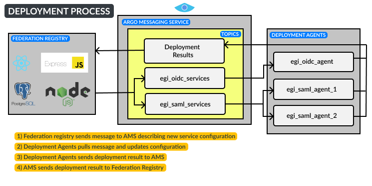

import {ImageExpand} from '../src/components/components';
import useBaseUrl from '@docusaurus/useBaseUrl';

one, or a deregistration changes have to be deployed on some remote system. This is an automated asynchronous process that uses the argo messaging service to communicate with these remote systems. Services that undergo this process are under waiting deployment status and although they will be displayed in service list view and can be viewed, creating new petitions option will be blocked until they are deployed.

